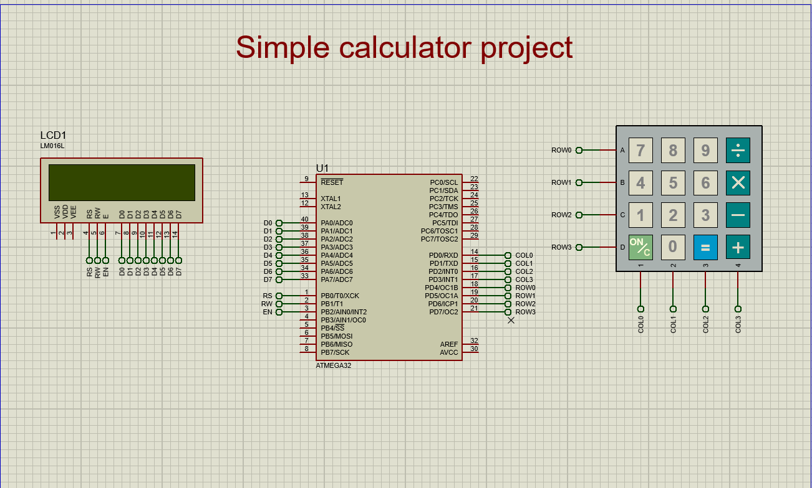

# 🧮 Embedded Calculator Project (AVR ATmega32)

This is one of my early embedded systems projects built using AVR microcontroller (ATmega32).  
It represents my journey into low-level C programming, driver development, and building a complete system using custom HAL/MCAL layers.

Honestly, it’s one of those projects that taught me how messy things can be at the beginning — and how powerful structured embedded design becomes later.

---

## 📌 Project Overview

This project implements a simple **4-function calculator system** using:

- ATmega32 microcontroller
- 4x4 Keypad
- 16x2 Character LCD (CLCD)
- Custom drivers (PORT, KEYPAD, CLCD)
- Syntax parsing + expression evaluation

The user enters a mathematical expression via keypad and gets the result on LCD.

---

## ⚙️ How It Works (System Flow)

### 1. Initialization
At startup:
- GPIO ports are initialized
- LCD is initialized
- Keypad becomes ready for input

---

### 2. Input Phase
The system continuously reads keypad input:

- Digits and operators are stored in a `syntax[]` buffer
- Each pressed key is displayed on LCD
- Special keys:
  - `=` → triggers calculation
  - `c` → clears screen and resets buffer

---

### 3. Syntax Building
As user enters input:
- Characters are stored sequentially in array
- LCD shows real-time input
- Screen shift happens if input exceeds display limit

---

### 4. Evaluation Phase
When `=` is pressed:

The system performs:

#### ✔ Validation
```c
validate_syntax(syntax);


#### ✔ Validation
```c
validate_syntax(syntax);


calculator_project/
│
├── main.c
├── service/
│   └── app.h
│
├── HAL/
│   ├── CLCD/
│   └── KEYPAD/
│
├── MCAL/
│   └── PORT/
│
├── the_schematic.png


---
```

---

## 🧪 Hardware Requirements

- ATmega32
- 16x2 LCD
- 4x4 Keypad
- 8 MHz clock

---

## 🔌 Simulation

This project was tested using Proteus simulation.

### 📌 Circuit Diagram

